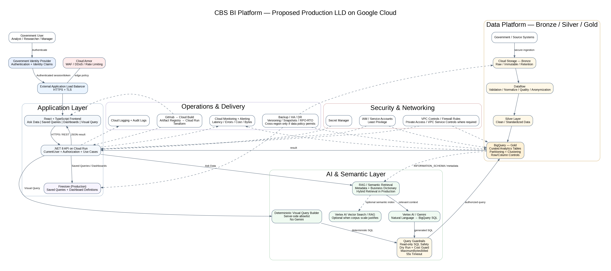

# CBS BI Platform

Cloud-native Business Intelligence POC designed for government analysts, researchers, managers, and business users who need to query data without writing SQL.

The project was built as a working proof of concept for a Google Cloud architecture assignment. It combines a React frontend, a .NET 8 backend, BigQuery, Gemini-based text-to-SQL, a semantic RAG layer, visual querying, saved queries, and dashboards.

> **Important:** The repository contains a working POC plus a proposed Production architecture. Components that are Production-design only are clearly distinguished from components that were implemented and runtime-verified.

---

## 1. What the POC demonstrates

### Ask Data — natural language analytics

A user can ask a business question such as:

```text
איזו עיר בעלת שיעור האבטלה הנמוך ביותר?
```

The request follows this flow:

```text
Natural Language Question
        ↓
Authentication / CurrentUser
        ↓
Authorization
        ↓
Semantic Retrieval (RAG)
        ↓
Metadata + Business Dictionary
        ↓
Gemini
        ↓
Generated BigQuery SQL
        ↓
Read-only SQL Safety
        ↓
BigQuery Dry Run
        ↓
Cost Guard
        ↓
MaximumBytesBilled
        ↓
BigQuery Execution
        ↓
Result
```

The system is designed to fail closed. If no relevant semantic context is available, it returns a controlled `422` response instead of allowing the model to invent an unsupported query.

### Visual Query — no SQL and no natural-language AI required

The user can also build a query through structured controls:

```text
Domain: Population
Metric: Population
Year: 2025
Sort: Highest
Limit: 5
```

The backend receives a structured DTO and generates SQL deterministically from server-side allowlists.

```text
Visual Query UI
      ↓
Structured Request
      ↓
Validation
      ↓
Server-side Domain / Metric Allowlist
      ↓
Deterministic SQL
      ↓
SQL Safety
      ↓
BigQuery Dry Run / Cost Guard
      ↓
BigQuery
      ↓
Result
```

Gemini is intentionally **not** used for Visual Query.

### Saved Queries

The POC supports:

- Save a successful analytics question
- List saved queries
- Run a saved query again
- Delete a saved query
- Per-user ownership and isolation

The POC store is currently in-memory.

### Dashboards

The POC supports:

- Create dashboards from saved queries
- List dashboards
- Open dashboard details
- Delete dashboards
- `Number` widgets
- `Table` widgets
- `BarChart` widgets

Dashboard widget execution currently runs through the existing analytics endpoint from the frontend.

---

## 2. Architecture



The full Production design includes:

- React frontend
- .NET 8 backend
- Government Authentication integration
- Authorization / IAM
- External HTTPS Load Balancer
- Cloud Armor
- Cloud Run
- VPC / Firewall controls
- Gemini / Vertex AI
- RAG semantic layer
- BigQuery
- Data Lake
- Bronze / Silver / Gold
- Secret Manager
- Cloud Logging
- Cloud Monitoring / Alerting
- Audit
- CI/CD
- Backup
- Disaster Recovery
- High Availability

Detailed architecture documents:

- [Architecture Design](architecture/architecture-design.md)
- [AI Architecture Deep Dive](architecture/ai-architecture.md)
- [Infrastructure Overview](infrastructure/README.md)
- [Production Deployment Design](infrastructure/deployment.md)

---

## 3. Technology Stack

### Frontend

```text
React
TypeScript
Vite
```

### Backend

```text
.NET 8
ASP.NET Core
C#
```

### Google Cloud

```text
BigQuery
Vertex AI / Gemini
Cloud Run          — Production target
Cloud Storage      — Production frontend / data lake target
Cloud CDN          — Production target
Cloud Load Balancing
Cloud Armor
Secret Manager
Cloud Logging
Cloud Monitoring
Cloud Build
Artifact Registry
IAM
VPC
```

### Current AI model used by the POC

```text
Gemini model: gemini-3-flash-preview
Vertex AI location: global
```

---

## 4. Repository Structure

```text
CBS-BI-Platform/
│
├── backend/
│   └── .NET 8 backend solution
│
├── frontend/
│   └── React + TypeScript client
│
├── architecture/
│   ├── README.md
│   ├── cbs-bi-lld.png
│   ├── architecture-design.md
│   └── ai-architecture.md
│
├── infrastructure/
│   ├── README.md
│   └── deployment.md
│
├── api-contracts/
│   ├── README.md
│   ├── poc-api-contracts.yaml
│   └── examples/
│
├── database/
│   ├── README.md
│   └── setup-demo.sql
│
└── README.md
```

---

## 5. Demo Data

The repository contains a reproducible BigQuery demo dataset.

The data is **synthetic demo data only** and is **not official CBS data**.

The current dataset contains four Gold-layer demo tables:

```text
city_population
city_employment_yearly
city_housing_yearly
city_education_yearly
```

The tables cover four business domains:

- Population
- Employment
- Housing
- Education

The yearly domain tables are designed with partitioning by `Year` and clustering by `CityCode`.

When multiple domains are joined, the semantic rule is:

```text
JOIN ON CityCode AND Year
```

See:

- [Database Setup](database/README.md)
- [BigQuery Demo Setup Script](database/setup-demo.sql)

---

## 6. Running the POC Locally

### Prerequisites

You need:

- .NET 8 SDK
- Node.js / npm
- A Google Cloud project
- BigQuery enabled
- Vertex AI enabled
- Google credentials available to the backend through an approved local authentication method
- Permission to use the configured Gemini model

Do **not** place Google credentials or service-account key files in the repository.

### Step 1 — Create the BigQuery demo dataset

Open BigQuery Studio in your Google Cloud project and run:

```text
database/setup-demo.sql
```

The script creates:

```text
analytics_demo
```

and the four demo tables.

The original POC was developed against:

```text
Google Cloud project: cbs-bi-poc
BigQuery dataset: analytics_demo
BigQuery location: me-west1
```

If you run the repository in another Google Cloud project, update the backend configuration / fully qualified BigQuery references according to the implementation.

### Step 2 — Configure backend access to Google Cloud

Authenticate the development machine using your organization's approved Google Cloud authentication mechanism.

The repository intentionally does **not** contain:

```text
service-account.json
access tokens
API keys
passwords
private credentials
```

Review the backend configuration for:

```text
BigQuery dataset
BigQuery location
MaximumBytesProcessed
Analytics request timeout
Gemini model / location
```

Current POC intent:

```text
BigQuery DatasetId: analytics_demo
BigQuery Location: me-west1
MaximumBytesProcessed: 1,000,000,000
Analytics RequestTimeoutSeconds: 55
```

### Step 3 — Run the backend

From the backend solution, restore/build/run using Visual Studio 2022 or the .NET CLI.

The local development API used during the POC is:

```text
https://localhost:7116
```

Swagger is available from the running ASP.NET Core application according to the project's development configuration.

### Step 4 — Run the frontend

From the `frontend` folder:

```bash
npm install
npm run dev
```

The Vite development URL is:

```text
http://localhost:5173
```

Configure the frontend API base URL through the existing Vite environment configuration, for example:

```text
VITE_API_BASE_URL=https://localhost:7116
```

---

## 7. Authentication and Authorization

### POC

The POC does not connect to the real Government Identity Provider.

Development authentication is simulated using the backend development authentication handler.

The frontend development API layer sends:

```text
X-Dev-UserId: dev-user
X-Dev-Roles: AnalyticsQueryExecutor
```

Runtime behavior was verified:

```text
No authenticated user
→ 401

Authenticated user without required permission
→ 403

Authenticated user with AnalyticsQueryExecutor
→ success
```

### Production design

Production replaces the development authentication adapter with integration to the approved Government Identity Provider.

```text
Government Identity Provider
          ↓
Authenticated principal / approved token mechanism
          ↓
.NET Authentication adapter
          ↓
ICurrentUserContext
          ↓
CurrentUser
          ↓
Authorization
```

The project deliberately does **not** implement:

- local registration
- username/password storage
- forgot password
- independent identity management

---

## 8. Semantic RAG Layer

The POC implements a technology-neutral semantic corpus composed of:

```text
Metadata Semantic Knowledge
+
Business Dictionary
```

### Metadata

Metadata is read from BigQuery `INFORMATION_SCHEMA` and includes:

- tables
- columns
- descriptions
- data types
- fully qualified references

### Business Dictionary

The Business Dictionary maps business terminology to analytics concepts such as:

```text
אוכלוסייה
עיר / ערים
אבטלה
מועסקים
שכר
דיור
מחיר דירה
שכירות
תלמידים
זכאות לבגרות
מורים
שנה
```

### Retrieval

The current POC uses lexical semantic retrieval.

It supports exact matching and controlled token containment matching.

A Vector Database was intentionally **not** added only to satisfy a checkbox.

For a larger Production semantic corpus, the architecture proposes evaluating:

```text
Embeddings
Hybrid Retrieval
Vector Search
```

when scale and retrieval quality justify it.

---

## 9. AI Query Generation

Ask Data uses Gemini only after semantic retrieval has produced relevant context.

Important prompt / generation rules include:

### Minimum table set

If one table contains all required data:

```text
Use one table.
Do not join unnecessarily.
```

### Latest year

If the user does not specify a year:

```text
Use MAX(Year)
```

rather than a hard-coded year.

### Cross-domain queries

When multiple city/year domains are required:

```text
JOIN ON CityCode AND Year
```

### Fail closed

If there is no semantic context:

```text
No semantic context
→ no unsupported Gemini generation
→ no BigQuery execution
→ controlled 422
```

---

## 10. Query Safety, Cost Protection and Timeout

Generated SQL is treated as untrusted input.

### Read-only SQL safety

The backend accepts analytics SQL beginning with:

```text
SELECT
WITH
```

and blocks DML / DDL operations.

The validator is designed not to mistake forbidden keywords that appear inside:

- string literals
- comments
- backtick identifiers

### BigQuery Dry Run

Before execution:

```text
SQL
 ↓
BigQuery Dry Run
 ↓
Estimated Bytes
 ↓
Cost Policy
```

### MaximumBytesBilled

Actual execution uses `MaximumBytesBilled` as an additional guardrail.

### Request timeout

Analytics execution is controlled by an ASP.NET Core request timeout.

POC intent:

```text
55 seconds
```

This leaves a margin below the one-minute response requirement.

Runtime cancellation was verified end-to-end against the Google SDK.

---

## 11. Performance

Runtime instrumentation measures:

```text
SemanticRetrieval
GeminiSqlGeneration
BigQueryDryRun
BigQueryExecution
AskQuestion Total
```

One runtime sample measured approximately:

```text
Semantic Retrieval      1.7 sec
Gemini SQL Generation   4.0 sec
BigQuery Dry Run        0.7 sec
BigQuery Execution      1.0 sec
Total                   7.4 sec
```

This was significantly below the one-minute requirement in the POC scenario.

---

## 12. API Surface

The public POC HTTP surface used by the React frontend includes:

### Ask Data

```http
POST /api/Analytics/ask
```

### Visual Query

```http
POST /api/analytics/visual-query
```

### Saved Queries

```http
POST   /api/analytics/saved-queries
GET    /api/analytics/saved-queries
DELETE /api/analytics/saved-queries/{id}
```

### Dashboards

```http
POST   /api/analytics/dashboards
GET    /api/analytics/dashboards
GET    /api/analytics/dashboards/{id}
DELETE /api/analytics/dashboards/{id}
```

See:

- [POC API Contracts](api-contracts/poc-api-contracts.yaml)
- [API Contract Notes](api-contracts/README.md)

Development-only diagnostic endpoints are intentionally not treated as the public product contract.

---

## 13. Example Demo Flow

A short reviewer demo can follow this order:

### 1. Ask Data

Ask:

```text
איזו עיר בעלת שיעור האבטלה הנמוך ביותר?
```

Show:

- natural-language request
- returned result
- generated SQL

### 2. Fail-closed semantic behavior

Ask an unsupported question such as:

```text
מהי הטמפרטורה הממוצעת בישראל?
```

Show the controlled semantic error instead of an invented query.

### 3. Saved Queries

Save a successful question.

Show:

- Saved Queries list
- Run Again
- Delete

### 4. Dashboard

Open a dashboard showing:

- Number widget
- Table widget
- BarChart widget

### 5. Visual Query

Select:

```text
Domain: Population
Metric: Population
Year: 2025
Sort: Highest
Limit: 5
```

Show:

- no SQL input
- deterministic result
- generated SQL

---

## 14. Automated Tests

The current Application test suite was runtime-verified with:

```text
118 tests
118 passed
0 failed
```

Application tests remain independent from Infrastructure implementations.

---

## 15. POC vs Production

| Capability | POC | Production Design |
|---|---|---|
| Frontend | React/Vite local | Cloud Storage + Cloud CDN + HTTPS Load Balancer |
| Backend | .NET 8 local | Cloud Run |
| Authentication | Development handler | Government Identity Provider |
| Authorization | Implemented abstraction | Government identity + enterprise IAM/policies |
| Saved Queries | In-memory | Persistent metadata store |
| Dashboards | In-memory | Persistent metadata store |
| BigQuery | Working synthetic dataset | Governed Gold analytics layer |
| Data Lake | Architecture only | Cloud Storage Bronze/Silver/Gold |
| RAG | Metadata + Business Dictionary + lexical retrieval | Hybrid/vector retrieval if justified |
| Gemini | Working | Managed Vertex AI model strategy |
| SQL Safety | Implemented | Implemented + Production policy |
| BigQuery Dry Run | Implemented | Implemented |
| Cost Guard | Implemented | Implemented + budgets/monitoring |
| Timeout | Implemented | Implemented + SLO monitoring |
| Secrets | Development configuration | Secret Manager |
| Edge Security | Local | Load Balancer + Cloud Armor |
| Observability | ILogger + timings | Cloud Logging/Monitoring/Alerting/Audit |
| CI/CD | Manual development | Cloud Build + Artifact Registry + controlled deployment |
| DR / HA | Architecture only | Defined RPO/RTO + restore/failover strategy |

---

## 16. Known POC Limitations

The following are deliberate POC limitations:

- Government authentication is not integrated with the real government identity service.
- Saved Queries are stored in memory.
- Dashboards are stored in memory.
- Data disappears from those in-memory stores when the backend process restarts.
- Dashboard widget execution is orchestrated by the frontend.
- Dynamic dashboard filters are not implemented.
- RAG currently uses lexical retrieval rather than embeddings/vector search.
- The demo dataset is small synthetic data, not the required Production scale.
- Full Production CI/CD, VPC controls, monitoring, alerting, backup and DR are documented but not deployed.
- No Google Cloud credentials are included in the repository.

These limitations are documented rather than hidden because the assignment is primarily an architecture exercise supported by a working POC.

---

## 17. Cost Optimization

The architecture proposes multiple cost controls, including:

1. BigQuery Dry Run before execution
2. `MaximumBytesBilled`
3. Partitioning and clustering
4. Minimum-table-set SQL generation
5. Semantic-context reduction
6. Query/result caching where justified
7. Model routing / lower-cost model usage where quality allows
8. Cloud Run autoscaling and controlled maximum instances
9. Lifecycle/retention policies for storage and logs

Details are available in the architecture documents.

---

## 18. Security Principles

The design follows:

- least privilege
- authenticated identity before analytics execution
- authorization before data access
- no secrets in Git
- generated SQL treated as untrusted
- read-only query validation
- bounded execution time
- bounded BigQuery cost
- user isolation for saved resources
- Production edge protection through Load Balancer / Cloud Armor
- auditability and observability

---

## 19. Design Principles Used in the Code

The implementation emphasizes:

```text
SOLID
Separation of Concerns
Dependency Inversion
Thin Controllers
External systems behind abstractions
No unnecessary Repository pattern
No unnecessary overengineering
```

The primary dependency direction is:

```text
API
 ↓
Application
 ↑
Infrastructure

Domain
```

More explicitly:

```text
API → Application + Infrastructure
Infrastructure → Application → Domain
Application → Domain
Domain → nothing
```

---

## 20. Submission Documents

Start here:

1. [Architecture Diagram](architecture/cbs-bi-lld.png)
2. [Architecture Design](architecture/architecture-design.md)
3. [AI Architecture Deep Dive](architecture/ai-architecture.md)
4. [Production Deployment Design](infrastructure/deployment.md)
5. [API Contracts](api-contracts/poc-api-contracts.yaml)
6. [Demo Database Setup](database/setup-demo.sql)

---

## 21. Reviewer Notes

The repository intentionally separates:

### Runtime-verified POC

```text
React
.NET 8
Ask Data
RAG
Gemini
SQL Safety
BigQuery Dry Run
Cost Guard
BigQuery Execution
Saved Queries
Dashboards
Visual Query
Authorization abstraction
118 passing Application tests
```

from:

### Production architecture

```text
Government Authentication
Cloud Run
Load Balancer
Cloud Armor
Persistent metadata storage
Production VPC / Firewall controls
Secret Manager
Cloud Build
Centralized Monitoring / Alerting / Audit
Backup
Disaster Recovery
High Availability
Production-scale Data Lake and Bronze/Silver/Gold pipelines
```

The objective is to demonstrate both **working implementation depth** and **Production architecture reasoning** without claiming that non-implemented cloud components are already deployed.
